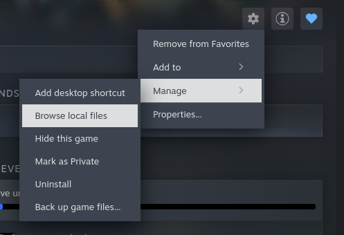

# 🎮 Warhammer 40K: Rogue Trader - Traduzione Italiana e strumento di traduzione 🇮🇹


Contenuti del repository:
1. il file della traduzione in Italiano di Warhammer 40K: Rogue Trader
  - Supporta le DLC **Void Shadows** e **Lex Imperialis**, aggiornati alla versione **1.4.1.208** (15 Luglio 2025)
2. lo strumento usato per generare una nuova traduzione, oppure aggiornare la traduzione corrente (in caso di nuovi aggiornamenti o DLC del gioco).

## 1. Come attivare la traduzione italiana

Per attivare la traduzione in Italiano del gioco, segui i seguenti passaggi:

1. Scarica il file `esES.json`

2. Apri la cartella d'installazione del gioco (esempio Steam)




3. Spostati nella cartella che contiene i file di traduzione: `WH40KRT_Data\StreamingAssets\Localization`

4. Sostituisci il file `esES.json` con quello scaricato al punto 1.

5. Avvia il gioco e cambia la lingua dalle impostazioni del gioco.

6. Goditi l'esperienza di gioco in Italiano! Emperor protect!

Se vuoi segnalare feedback, miglioramenti o imprecisioni, apri una issue.

Se vuoi usare lo script per aggiornare e/o modificare la traduzione, continua a leggere le sezioni successive.

## 2. Strumento di traduzione

Uno strumento di traduzione specializzato per localizzare i file di testo del gioco Warhammer 40,000: Rogue Trader in italiano, alimentato da Claude AI con caching avanzato e ottimizzazione dei costi.

### ✨ Caratteristiche

- **🎯 Traduzione Specializzata**: Traduzione italiana di livello esperto specificamente ottimizzata per la terminologia di Warhammer 40K e del gaming
- **💰 Ottimizzazione dei Costi**: Il caching avanzato del prompt riduce i costi di traduzione fino all'80%
- **📊 Supporto Multi-Modello**: Compatibile con Claude 3 Haiku, Claude 3.5 Haiku, Claude 3.5 Sonnet e Claude 4 Sonnet
- **🔄 Tracciamento Progresso**: Riprendi traduzioni interrotte con salvataggio automatico del progresso
- **🛡️ Preservazione del Lore**: Mantiene la terminologia autentica di Warhammer 40K in inglese mentre traduce il testo del gioco
- **⚡ Elaborazione Batch**: Processa efficacemente grandi file JSON con limitazione del rate e gestione degli errori

### 🚀 Avvio Rapido

#### Prerequisiti

- Python 3.7+
- Chiave API Anthropic
- File JSON contenente le stringhe del gioco da tradurre

#### Installazione

1. Clona il repository:
```bash
git clone https://github.com/yourusername/wh40k-rogue-trader-translator.git
cd wh40k-rogue-trader-translator
```

2. Installa le dipendenze richieste:
```bash
pip install anthropic
```

3. Imposta la tua chiave API Anthropic:
```bash
export ANTHROPIC_API_KEY="la-tua-chiave-api-qui"
```

#### Utilizzo Base

```bash
python translator.py input.json output.json
```

- `input.json` e' il file di traduzione originale del gioco
- `output.json` e' il nuovo file fi traduzione che si vuole creare

#### Utilizzo Avanzato

```bash
python translator.py input.json output.json \
  --model claude-3-5-sonnet-20241022 \
  --progress my_progress.json \
  --delay 2.0
  --prompt prompt.txt
```

#### Cosa faccio se una frase non e' tradotta come mi aspetto?

1. Interrompi il processo di traduzione (CTRL+C)
2. Trova e rimuovi la frase dal file `translation_progress.json`
3. Apporta le modifiche al prompt `prompt.txt`
4. Riavvia il processo di traduzione

### 🔧 Opzioni di Configurazione

| Parametro | Descrizione | Default |
|-----------|-------------|---------|
| `input_file` | Percorso del file JSON di input | Obbligatorio |
| `output_file` | Percorso del file JSON di output | Obbligatorio |
| `--progress` | File di tracciamento progresso | `translation_progress.json` |
| `--delay` | Ritardo tra chiamate API (secondi) | `1.0` |
| `--model` | Modello Claude da utilizzare | `claude-3-5-haiku-20241022` |

#### Modelli Disponibili

| Modello | Costo Input | Costo Output | Lettura Cache | Migliore Per |
|---------|-------------|--------------|---------------|--------------|
| `claude-3-haiku-20240307` | $0.25/1M | $1.25/1M | $0.03/1M | Traduzioni economiche |
| `claude-3-5-haiku-20241022` | $0.80/1M | $4.00/1M | $0.08/1M | **Raccomandato** |
| `claude-3-5-sonnet-20241022` | $3.00/1M | $15.00/1M | $0.30/1M | Traduzioni di alta qualità |
| `claude-sonnet-4-20250514` | $3.00/1M | $15.00/1M | $0.30/1M | Qualità premium |

### 🎯 Principi di Traduzione

#### Caratteristiche Principali

- **Consistenza del Lore**: Preserva tutta la terminologia di Warhammer 40K in inglese
- **Standard Gaming**: Utilizza convenzioni di localizzazione gaming italiana consolidate
- **Preservazione Formato**: Mantiene tutti i tag HTML, codici markup e formattazione
- **Consapevolezza del Contesto**: Adatta tono e stile in base al tipo di contenuto

#### Termini Protetti

Il traduttore preserva queste categorie in inglese:
- **Nomi Personaggi**: Abelard, Cassia, Pasqal, Yrliet, ecc.
- **Terminologia Imperiale**: Imperium, Adeptus Mechanicus, Rogue Trader, ecc.
- **Equipaggiamento Militare**: Bolter, chainsword, power armor, ecc.
- **Termini Navali**: Voidship, gellar field, warp drive, ecc.
- **Chaos & Warp**: Khorne, Tzeentch, daemon, psyker, ecc.
- **Razze Xenos**: Eldar, Ork, Tau, Tyranid, ecc.

### 📊 Ottimizzazione dei Costi

#### Vantaggi del Caching

Lo strumento utilizza il caching del prompt per ridurre drasticamente i costi:

- **Prima Traduzione**: Costo completo del prompt di sistema
- **Traduzioni Successive**: Riduzione del 90%+ del costo del prompt di sistema
- **Risparmio Tipico**: 60-80% di riduzione del costo totale
- **Durata Cache**: Persiste attraverso le chiamate API

### 🛠️ Dettagli Tecnici

#### Formato Input

Lo strumento si aspetta file JSON con questa struttura:

```json
{
  "strings": {
    "string_id": {
      "Offset": 12345,
      "Text": "Testo da tradurre"
    }
  }
}
```

#### Formato Output

I file tradotti mantengono la stessa struttura:

```json
{
  "strings": {
    "string_id": {
      "Offset": 12345,
      "Text": "Testo tradotto"
    }
  }
}
```

#### Tracciamento Progresso

Lo strumento salva automaticamente il progresso per prevenire perdite di dati:

- **File Progresso**: Traccia traduzioni completate
- **Supporto Ripresa**: Salta automaticamente stringhe già tradotte
- **Salvataggio Automatico**: Salva progresso ogni 10 traduzioni

### 📈 Monitoraggio Performance

Statistiche in tempo reale durante la traduzione:

```
📊 Utilizzo token - Input: 2,458, Output: 156
💾 Cache hit: 2,048 token (COSTO RISPARMIATO!)
💰 Ripartizione costi:
   Creazione cache: $0.000000
   Lettura cache: $0.000164
   Input regolare: $0.000328
   Output: $0.000624
   Totale: $0.001116
```

### 🔒 Gestione Errori

- **Limitazione Rate API**: Ritardi configurabili tra le richieste
- **Errori di Rete**: Logica di retry automatica
- **Protezione Progresso**: Salva progresso prima di ogni traduzione
- **Interruzione Elegante**: Gestisce interruzioni Ctrl+C

### 🤝 Contribuire

I contributi sono benvenuti! Sentiti libero di:

1. Fare fork del repository
2. Creare un branch per la feature
3. Apportare le tue modifiche
4. Inviare una pull request

### 📄 Licenza

Questo progetto è sotto licenza MIT - vedi il file [LICENSE](LICENSE) per dettagli.

### 🐛 Supporto

Se riscontri problemi:

1. Controlla la pagina [Issues](https://github.com/EasyPeasyViking/warhammer-40k-rogue-trader-italian/issues)
2. Crea una nuova issue con informazioni dettagliate
3. Includi output log rilevanti e messaggi di errore

## ⚖️ Disclaimer Legale

**Questo progetto è completamente indipendente e non affiliato in alcun modo con:**

- **Games Workshop Ltd** - Detentore dei diritti di Warhammer 40,000
- **Owlcat Games** - Sviluppatore di Warhammer 40,000: Rogue Trader
- **Anthropic** - Fornitore della tecnologia Claude AI

### Diritti di Proprietà Intellettuale

- **Warhammer 40,000**, **Rogue Trader**, e tutti i nomi, personaggi, luoghi, terminologia e iconografia correlata sono marchi registrati e proprietà intellettuale di **Games Workshop Ltd**.
- **Warhammer 40,000: Rogue Trader** (il videogioco) è proprietà di **Owlcat Games** e **Games Workshop Ltd**.
- Tutti i contenuti del gioco, inclusi testi, dialoghi, descrizioni e materiale narrativo, sono protetti da copyright.

### Scopo del Progetto

Questo strumento è stato creato esclusivamente per:
- **Scopi educativi** e di apprendimento della programmazione
- **Uso personale** per la traduzione di contenuti di gioco già posseduti
- **Ricerca e sviluppo** di tecnologie di traduzione automatica
- **Supporto alla community** di modding e localizzazione

### Limitazioni d'Uso

- **NON** per uso commerciale o distribuzione
- **NON** per la violazione di diritti d'autore
- **NON** per la creazione di contenuti derivati commerciali
- **NON** supportato o approvato ufficialmente dagli sviluppatori

### Responsabilità dell'Utente

Gli utenti sono responsabili di:
- Possedere legalmente una copia del gioco prima di utilizzare questo strumento
- Rispettare tutti i termini di servizio e licenze applicabili
- Utilizzare le traduzioni solo per uso personale
- Non distribuire contenuti tradotti senza autorizzazione

## Rimozione Contenuti

Se **Games Workshop Ltd**, **Owlcat Games**, o altri detentori di diritti ritengono che questo progetto violi i loro diritti, sono invitati a contattarci per una rimozione immediata.

## Traduzione Community Italiana

**⚠️ Importante**: La traduzione in questo repository è stata **generata completamente con AI** (Claude). Pur essendo ottimizzata per Warhammer 40,000: Rogue Trader, potrebbe presentare imprecisioni linguistiche.

Per una **traduzione curata da traduttori italiani**, visita **Language Pack Italia**:

- [**Sito**](https://languagepack.it/warhammer-40000-rogue-trader/)
- [**Discord**](https://discord.gg/VrGZTybfQ6)
